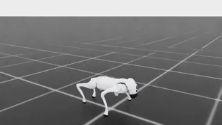

# Unitree Go2 Backflip on Isaac Lab

Docker Compose setup for training and checking a Unitree Go2 backflip policy in Isaac Lab.


The project is intentionally Isaac-only:

- simulator: Isaac Sim / Isaac Lab
- robot asset: Isaac Lab built-in `Robots/Unitree/Go2/go2.usd`
- task: `Unitree-Go2-Backflip-Isaac-v0`
- RL backend: RSL-RL
- runtime: headless Docker Compose, with optional video recording

The training environment lives in this repo as a local `go2_backflip` package. It does not clone or patch `unitree_rl_lab`, and it does not require external robot asset migration.

## Requirements

- NVIDIA driver and NVIDIA Container Toolkit
- `docker compose`
- Access to pull `nvcr.io/nvidia/isaac-lab:2.3.2`
- Acceptance of the NVIDIA Isaac Sim / Isaac Lab EULA

## Quickstart

```bash
cp .env.example .env
# Edit .env and set ACCEPT_EULA=Y and PRIVACY_CONSENT=Y after accepting the NVIDIA terms.
make build
NUM_ENVS=64 MAX_ITERATIONS=1 RUN_NAME=backflip-check make train
```

The last command starts Isaac Lab headlessly for one training iteration to check env reset/step plus RSL-RL actor/critic wiring.

## Training

```bash
make train
```

The default training run uses:

- `NUM_ENVS=4096`
- `MAX_ITERATIONS=1000`
- run name `backflip`
- log root `logs/rsl_rl/unitree_go2_backflip_isaac/`

Useful overrides:

```bash
NUM_ENVS=1024 MAX_ITERATIONS=200 make train
MAX_ITERATIONS=300 make resume
CHECKPOINT=/workspace/backflip/logs/rsl_rl/unitree_go2_backflip_isaac/<run>/model_1000.pt make resume
```

`make resume` searches for the latest `backflip` or `backflip-resume` run unless `LOAD_RUN`, `CHECKPOINT`, or `CHECKPOINT_PATH` is provided.

## Policy Export

Export a deterministic TorchScript actor for inference:

```bash
make export-policy
```

By default this writes `policy.pt` next to the selected checkpoint. The exported module contains only the actor mean path, accepts `observations` with shape `(1, 60)`, and returns deterministic actions with shape `(1, 12)`. It does not include the critic, optimizer state, or action log standard deviation.

```bash
LOAD_RUN='.*_backflip-resume$' make export-policy
CHECKPOINT_PATH=/workspace/backflip/logs/rsl_rl/unitree_go2_backflip_isaac/<run>/model_1000.pt make export-policy
POLICY_PATH=/workspace/backflip/logs/policy.pt make export-policy
```

## Environment Design

The backflip task is implemented as an Isaac Lab `DirectRLEnv`.

- time-phased reward windows inside a single episode
- explicit torque PD control instead of position-target actions
- `clip_actions=100.0`, `action_scale=0.5`
- one policy-step action latency
- actor observation: 60 dimensions
- critic observation: 64 dimensions
- timeout-only termination
- train-time randomization for control gains, motor offsets, friction, base mass, and base CoM
- play-time randomization disabled for deterministic visual checks

The default robot asset is Isaac Lab's built-in Go2 USD. To experiment with a different Isaac/Unitree USD, set:

```bash
GO2_BACKFLIP_USD_PATH=/path/or/nucleus/url/to/go2.usd make train
```

## Safety and Security Notes

This repository is a simulation training demo, not a deployable robot controller. Do not run learned policies on hardware without a separate safety review, torque/velocity limits, emergency stop handling, and controlled testing.

The Docker Compose service uses NVIDIA GPU access, root inside the container, and host IPC/network settings for Isaac Lab compatibility. Run it only on a machine where you trust the image and project contents.

Keep local `.env` files, training logs, checkpoints, videos, and experiment tracker outputs out of Git. They are ignored by default.

## Video

Generate a headless Isaac renderer video:

```bash
make play-video
```

The video is written below the selected checkpoint directory, usually:

```text
logs/rsl_rl/unitree_go2_backflip_isaac/<run>/videos/play/
```

`make play-video` looks for the latest `backflip` or `backflip-resume` checkpoint. A checkpoint can be selected explicitly:

```bash
LOAD_RUN='.*_backflip-resume$' make play-video
CHECKPOINT_PATH=/workspace/backflip/logs/rsl_rl/unitree_go2_backflip_isaac/<run>/model_1000.pt make play-video
```

Isaac renderer videos default to `VIDEO_RENDERING_MODE=quality` to reduce noisy shadows and temporal artifacts. Use `balanced` for a lighter render or `performance` for quick checks:

```bash
VIDEO_RENDERING_MODE=balanced make play-video
VIDEO_RENDERING_MODE=performance make play-video
```

Camera tracking is enabled by default for play video. It can be adjusted with:

```bash
PLAY_CAMERA_EYE_OFFSET=1.6,-2.2,0.9 PLAY_CAMERA_TARGET_OFFSET=0,0,0.25 make play-video
PLAY_CAMERA_TRACKING=0 make play-video
```

## Included Assets

`assets/demo.gif` is a rendered preview of the learned backflip behavior.

`assets/policy.pt` is an exported deterministic TorchScript actor for the Isaac Lab Go2 backflip task. The matching training configuration snapshot is in `assets/params/`.

PyTorch checkpoints and TorchScript files use Python/PyTorch serialization. Only load model files from repositories and authors you trust.

## Make Targets

```bash
make build
make list-envs
make train
make resume
make export-policy
make play-video
```

## Repository Layout

- `source/go2_backflip/go2_backflip/tasks/backflip_isaac/`: Isaac Lab backflip task
- `scripts/rsl_rl/`: local RSL-RL train/play entrypoints
- `scripts/train.sh`: Docker-friendly training launcher
- `scripts/export_policy.sh`: TorchScript policy export launcher
- `scripts/play_video.sh`: video launcher
- `logs/`: training logs, checkpoints, and videos
- `cache/`: Isaac Sim / Omniverse / pip cache

## Acknowledgements

The reward design and training flow were informed by [`ziyanx02/Genesis-backflip`](https://github.com/ziyanx02/Genesis-backflip). This repository is an Isaac Lab / Isaac Sim reimplementation that uses Isaac Lab's built-in Unitree Go2 asset and local task registration.

## License

Copyright 2026 Tatsuya Ogawa.

This repository is licensed under the Apache License 2.0. See [LICENSE](LICENSE).
